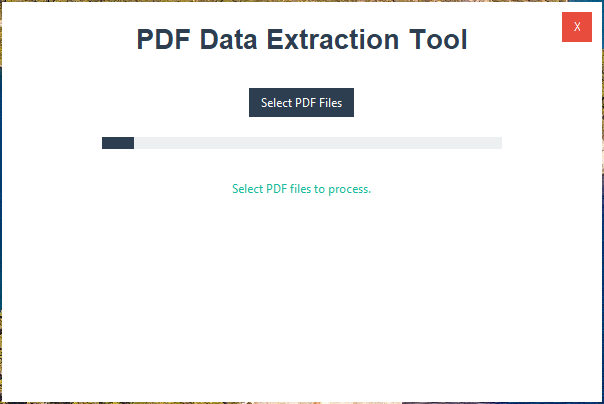
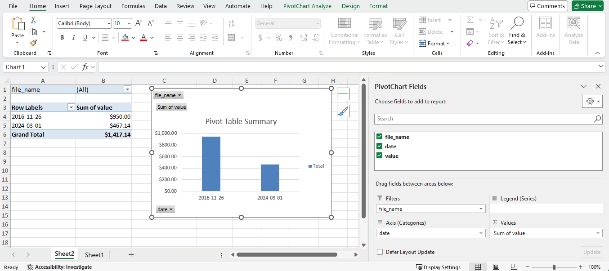

# PDF Data Extraction Tool

## Overview

A Python-based tool to extract data from PDF files and export it to CSV and Excel formats. It is designed for processing invoices and tabular data efficiently.

## Features

- Extracts dates, monetary values, and specific fields from PDFs.
- Converts currencies to a unified format (e.g., USD).
- Outputs data in:
  - CSV format (`output_csv.csv`)
  - Excel format with a pivot table (`output_xlsx.xlsx`).
- User-friendly GUI with:
  - Progress bar
  - Notifications for task completion


## Installation

### Prerequisites

- Python 3.7 or later
- Internet connectivity (for currency conversion)

### Steps

1. Clone the repository or download the source code:
   ```bash
   git clone <repository-url>
   cd <repository-directory>
   ```
2. Install dependencies:
   ```bash
   pip install -r requirements.txt
   ```
3. (Optional) Create and activate a virtual environment:
   ```bash
   python -m venv myenv
   source myenv/Scripts/activate  # On Windows
   ```

## Usage

### Using the Executable File

- Navigate to the `dist/` folder to find the executable file (`DataExtractionFromPDF.exe`).
- To run the `.exe` file, ensure that privacy settings on your operating system allow the execution of unsigned applications.
- No additional installation is required to execute the `.exe` file.
- PDF files can be selected from any folder on your system through the GUI.

### Using the Python Script

1. Run the main script:
   ```bash
   python DataExtractionFromPDF.py
   ```
2. Use the GUI to select PDF files (e.g., `sample_invoice_1.pdf`, `sample_invoice_2.pdf`) for processing.
3. The progress bar will indicate the status. Notifications appear upon completion.
4. Outputs are stored in the root directory as `output_csv.csv` and `output_xlsx.xlsx`.


## Requirements

Dependencies listed in `requirements.txt`:
- `pandas`
- `openpyxl`
- `requests`
- `PyMuPDF`
- `ttkbootstrap`
- `pywin32`

Install them using:
```bash
pip install -r requirements.txt
```

## File Structure

- `DataExtractionFromPDF.py`: Main script for running the application.
- `requirements.txt`: List of dependencies.
- `dist/`: Folder containing the compiled executable (`DataExtractionFromPDF.exe`).
- `image/`: Contains images for documentation (`UI.png`, `Pivottable.png`).
  
  
  

- Example PDFs: `sample_invoice_1.pdf`, `sample_invoice_2.pdf`.
- Output Files:
  - `output_csv.csv`: Processed data in CSV format.
  - `output_xlsx.xlsx`: Data in Excel format with pivot table.

## Notes

- Ensure internet connectivity for currency conversion functionality.
- Developed and tested on Windows OS. Adjustments may be required for other platforms.


